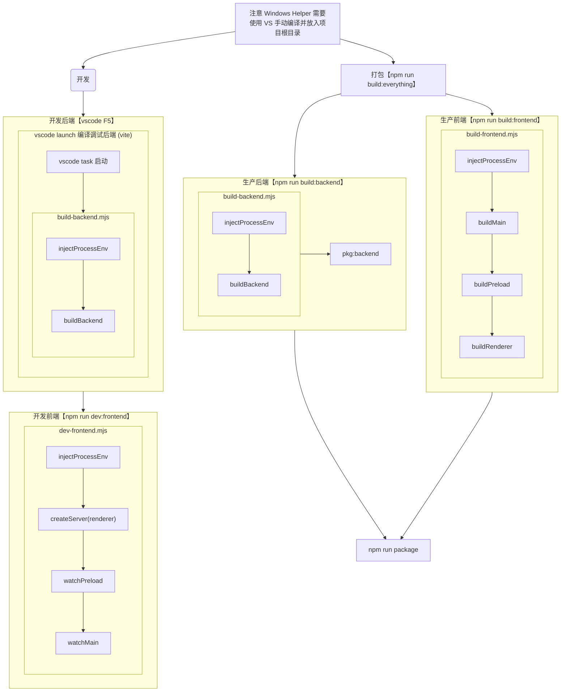

# FFBox 👋

一个多媒体转码百宝箱 / 一个 FFmpeg 的套壳  

软件介绍请转到 [FFBox 官网](http://ffbox.ttqf.tech/)。

## 工程简介

您现在看到的是 4.x 版本的 readme 文件。FFBox 在不同的大版本之间，使用的技术/框架存在区别。若需查阅版本对应的 readme，建议切换到对应分支。

- `1.x 版本`：经典的“html + css + js”前端三件套，没有工程化和模块化。
- `2.x 版本`：使用 vue 2 进行工程化、模块化开发。主要控制逻辑集中在状态管理器上。
- `3.x 版本`：更好的高聚低耦与工程结构，服务与 UI 分离，引入 TypeScript，支持远程控制。
- `4.x 版本`：全新界面，使用更新、更多样的技术架构，自行编写开发与打包脚本，彻底分离前后端。

## 准备自行编译

由于这里不是前端课堂，此处当然不会有手把手的详细指南🌚。以下会列出一些需要的东西，您可自行了解：

1. `Visual Studio Code`：这是本项目推荐使用的编辑器。本项目已为该编辑器进行了启动后端等相关任务的编写。
2. `node.js`：它是一个 JavaScript 运行环境，主要用于项目的编译。建议使用 `nvm`，当项目运行不起来的时候可尝试使用它来切换一下 node.js 的版本。
3. `pnpm`：它是本项目推荐使用的依赖管理器。
4. `pnpm set registry ___` `pnpm set ELECTRON_MIRROR`：如果您无法正常下载依赖，请配置源。
5. `Visual Studio 2022`：如果您要在 Windows 平台上编译 FFBoxHelper，那么这是必须的。

## FFmpeg

本项目并不自带 FFmpeg。如果您没有 FFmpeg，那么 FFBox 只能为您展示启动命令，不能进行转码工作。您需要在 [FFmpeg 下载页面](http://ffmpeg.org/download.html) 下载 FFmpeg 后，根据 FFBox 的指示，将其放入系统路径（推荐）或程序目录中。

## 开发与打包流程

